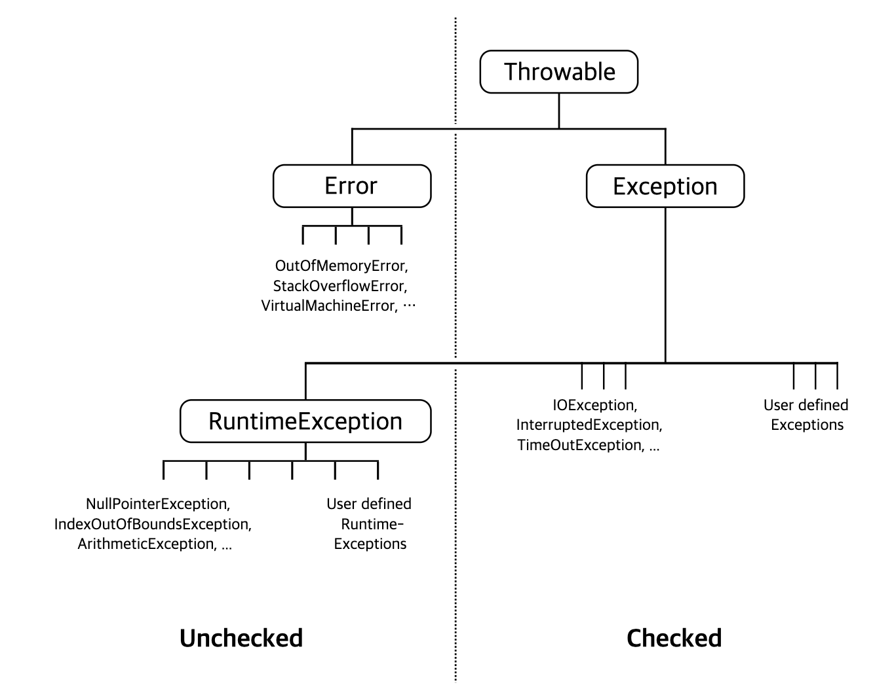

# 복구할 수 있는 상황에는 검사 예외를, 프로그래밍 오류에는 런타임 예외를 사용하라.

### `throwable` 타입
자바는 `throwable` 타입으로 검사 예외, 런타임 예외, 에러 이렇게 세 가지를 제공합니다. 이것들을 어떤 상황에 사용해야 할지 알아보도록 하겠다.

1. 검사 예외
- 호출하는 쪽에서 복구하리라 여겨지는 상황일때 사용한다.
- 검사 예외를 던지면 호출자가 그 예외를 `catch`로 처리하거나 더 바깥으로 전파하도록 **강제** 된다.
- 따라서 검사 예외를 사용하면 클라이언트에게 이 메서드를 호출 했을 때 발생할 수 있는 유력한 예외라는 것을 명시적으로 알려주게 된다.

> 비검사 throwable은 두 가지로, 런타임 예외와 에러가 있다.
> 이 둘은 프로그램에서 잡을 필요가 없거나 잡아서는 안된다.
> 프로그램에서 비검사 예외나 에러를 던졌다는 것은 보국가 불가능하거나 더 실행해봐야 득보다 실이 많다는 뜻이다.

2. 런타임 예외
- 프로그래밍 오류를 나타낼 때 런타임 예외를 사용한다.
- 런타임 예외는 전제조건을 만족하지 못햇을 때 발생한다. (클라이언트가 API 명세의 제약에 만족하지 못한 경우)
- 개발자가 구현하는 비검사 throwable은 모두 `RuntimeException`이어야 한다.

3. 에러
- `StackOverflowError`나 `OutOfMemoryError`와 같이 핸들링이 불가능하고 회복이 불가능한 에러를 말한다.
- 자바 언어 명세가 요구하는건 아니지만 업계에 널리 퍼진 규약이므로 `Error` 클래스를 상속하거나 `throw`문을 직접 던져서도 안된다.

### `throwable`은 직접 사용하지 말 것
이미 정의된 예외 클래스들의 메서드는 대부분 예외를 일으킨 상황에 대한 정보를 코드 형태로 전달하는데 사용된다. 만약 이런 메서드가 없다면 개발자가 직접 오류 메시지를 파싱해야한다.

그런데 예외의 최상위 클래스인 `Throwable`은 대부분 오류 메시지 포맷을 상세히 기술해두지 않았다.
즉, JVM이나 릴리즈 버전에 따라 포맷이 달라질 수 있다는 것을 뜻하는데, 간단히 말해 메세지를 파싱해서 얻은 코드가 깨지기 쉽고 환경에 따라 제대로 동작하지 않을 수 있다.
